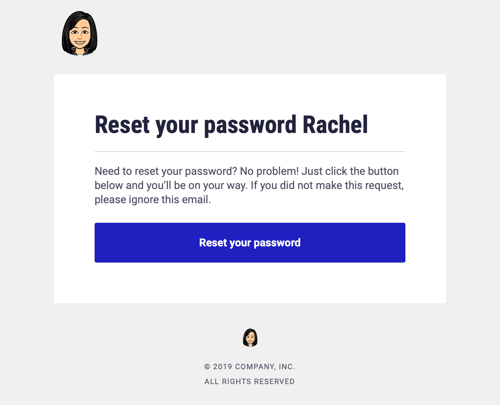

## Feathers Mailer - Extends User Roles and Management

### Background

This project demonstrates how to create beautiful transactional emails using [Pug](https://pugjs.org/api/getting-started.html) and [Feathers Mailer](https://github.com/feathersjs-ecosystem/feathers-mailer). It extends the functionality of the [User Roles and Management Project](https://github.com/meditatingdragon/quasar-feathersjs-user-management), which is documented in [this article](https://dev.to/rachel_cheuk/intro-user-roles-and-management-with-quasar-feathersjs-mongodb-4hk5).

### Functionality

- Template Emails Compiled with Pug
- Insert variables into templates
- Send emails

### Configuration

#### Quasar Frontend

The frontend is a starter. You will want to customize to your brand/color/theme. View the [Quasar Docs](https://quasar.dev) to learn more about how to add your own brand. The `boot/axios` and `boot/feathersClient` files may need to be updated based on the endpoint you are targetting.

#### FeathersJS Backend

The backend is scaffolded with Feathersjs. See the [configuration documentation](https://docs.feathersjs.com/api/configuration.html) for more information on how to configure your app. If you are forking this repo, you will want to generate a new secure secret.

### Docker

This repo can be run locally with [Docker Compose](https://docs.docker.com/compose/) using `docker-compose up`, though some configuration files may need to be updated/created to properly run locally. Alternately, you can run the `client` and `server` repos separately.

#### Client

Client can be run with the Quasar CLI using `quasar dev`. Make sure to [install the Quasar CLI](https://quasar.dev/quasar-cli/installation) first.

#### Server

Server can be run with node using `npm run dev`.

#### Screenshots

### Email

